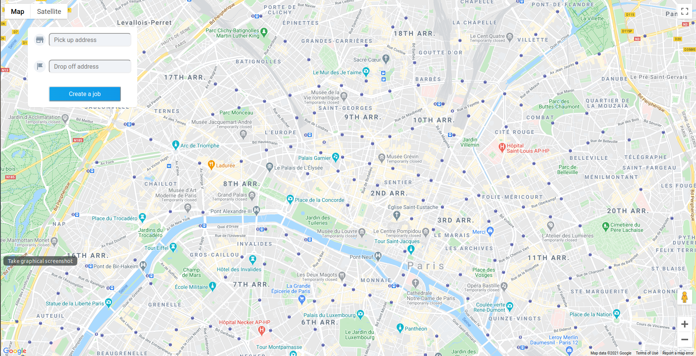
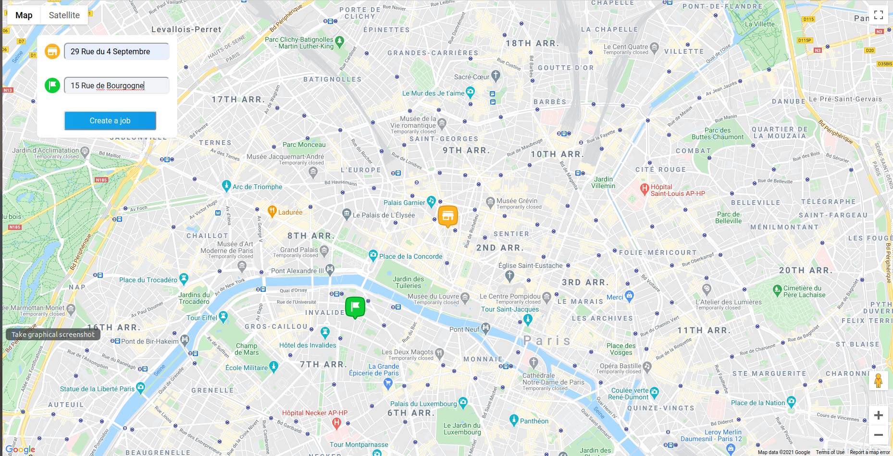
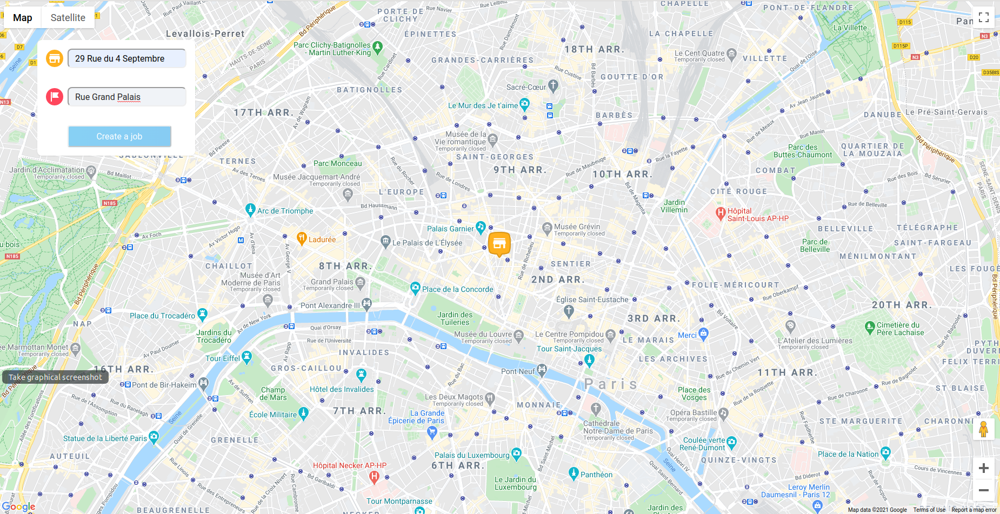
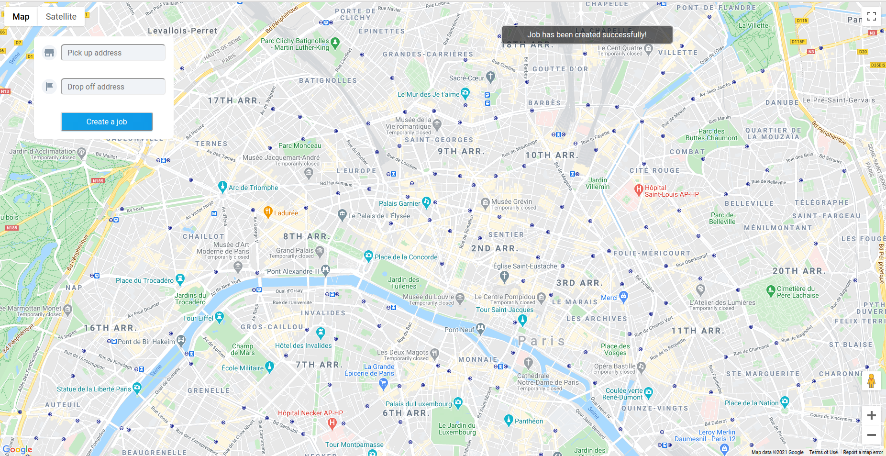

# STUART FRONTEND CHALLENGE 🚴💫

🌟 Welcome to my Stuart Frontend Challenge! 🌟

If you want to know more about the project, keep reading  👀

## Step 1

Implement this design in React.js following the design specifications.

## Step 2

The address should be geocoded by sending a request. 
If the address is valid, the icon color should change (yellow for Pick Up and green for Drop Off) and a marker should be added on the map.

If the address is invalid, the icon color should be red.

## Step 3 & Step 4

Once we have two valid addresses, when the user clicks on the button a new request should be send. Once the request is done, the form should
be reseted and a toaster saying "Job has been created successfully!" should appear

## Let's try!

If you want to test if my project works, you should know that the API work with two addresses *29 Rue du 4 Septembre* and *15
Rue de Bourgogne*

Write them in the form and test 🚴💫

## Available Scripts

In the project directory, you can run:

### `npm install`
To install all the dependencies used in this project. Which are:
- Moment. A library to parse, validate, manipulate and display dates and times in Javascript.
- Node-sass: to work with SASS to compile SASS to CSS.
- Prop-Types: to checking React props and validated them.
- Semantic-ui-react: for the pop-up showing when a favorite location is added.
- React-select: to create the select element for places as a loading asynchronously when the user is searching.
- React-live-clock: to create a clock that provides the user current hour.

### `npm start`

Runs the app in the development mode. 
Open [http://localhost:3000](http://localhost:3000) to view it in the browser.
The page will reload if you make edits.  You will also see any lint errors in the console.
